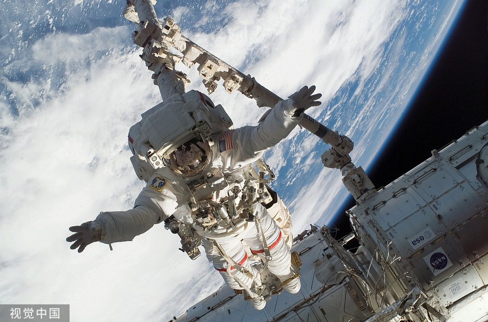

<!--## Hi there 👋

**violetlove1/violetlove1** is a ✨ _special_ ✨ repository because its `README.md` (this file) appears on your GitHub profile.

Here are some ideas to get you started:

- 🔭 I’m currently working on ...
- 🌱 I’m currently learning ...
- 👯 I’m looking to collaborate on ...
- 🤔 I’m looking for help with ...
- 💬 Ask me about ...
- 📫 How to reach me: ...
- 😄 Pronouns: ...
- ⚡ Fun fact: ...
-->
# Hi there, I'm Le Zhang 👋

🎓 Ph.D. Student in NWPU
🚀 Space | Robot |  Control   
📍 Northwestern Polytechnical University, China  

---

## 🎓 Education

| Degree | Major | University | Period |
|---|---|---|---|
| 🧑‍🎓 **B.S.** | Aircraft Control and Information Engineering | Northwestern Polytechnical University, China | 2021 |
| 🧑‍🔧 **M.S.** | Mechanical Engineering | Nanjing University of Aeronautics and Astronautics, China | 2025 |
| 🧑‍🚀 **Ph.D.** | Control Science and Engineering | Northwestern Polytechnical University, China | 2025 - Present |
---

## 🔬 Research Interests

## 🛠️ Research Skills

  

  Image from [https://www.vcg.com/creative/1485263136.html].

## 📫 Contact Me

<!---->
<!---->
