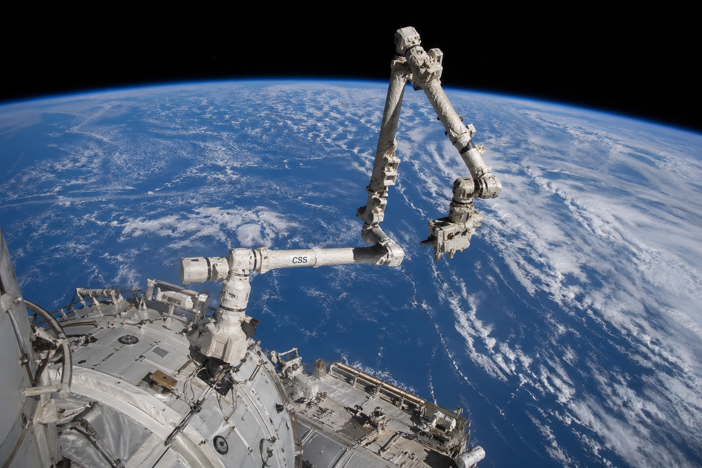

<!--## Hi there 👋

**violetlove1/violetlove1** is a ✨ _special_ ✨ repository because its `README.md` (this file) appears on your GitHub profile.

Here are some ideas to get you started:

- 🔭 I’m currently working on ...
- 🌱 I’m currently learning ...
- 👯 I’m looking to collaborate on ...
- 🤔 I’m looking for help with ...
- 💬 Ask me about ...
- 📫 How to reach me: ...
- 😄 Pronouns: ...
- ⚡ Fun fact: ...
-->
# Hi there, I'm Le Zhang 👋

🎓 Ph.D. Student in Astronautics  
🚀 Space Robotics | Motion Planning | Control Systems  
📍 Northwestern Polytechnical University, China  

---

## 👨‍💻 About Me

I received the B.S. degree in **Aircraft Control and Information Engineering** from  
**Northwestern Polytechnical University**, China, in 2021, and the M.S. degree in  
**Mechanical Engineering** from **Nanjing University of Aeronautics and Astronautics**, China, in 2025.

I am currently pursuing the Ph.D. degree with the **School of Astronautics** at  
**Northwestern Polytechnical University**, China.

My current research interests include **planning and control for space robotic systems**.

---
## 📫 Contact

- 📧 Email: 1973573467@qq.com
- 🎓 Academic Email: zhang.le@mail.nwpu.edu.cn

## 🔬 Research Interests

## 🛠️ Research Skills

  

  Image generated by ChatGPT.

<!---->
<!---->
